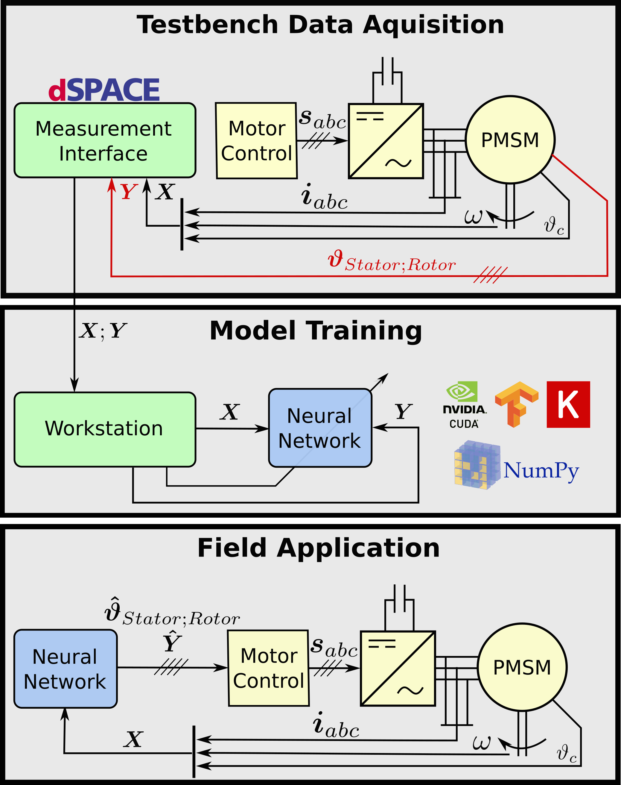

<p align="center">
  
</p>

---
[](https://raw.githubusercontent.com/upb-lea/deep-pmsm/master/LICENSE)

**DEEP learning for Permanent Magnet Synchronous Motor temperatures**. This project aims to estimate temperature sequences inside Permanent Magnet Synchronous Motors from given input sequences, that is, 
currents, voltages, coolant and ambient temperatures, and torque as well as motor speed.
All sensor data is recorded on a testbench.

# Getting Started
In order to clone this repo and use as a package in your own python projects, proceed as follows:
```
user@pc:~/projects$ git clone git@github.com:wkirgsn/deep-pmsm.git
user@pc:~/projects$ cd deep-pmsm
user@pc:~/projects/deep-pmsm$ pip install [-e] .
```
Use the "-e" flag in case you wish to edit the package. 
After installing via pip you can simply import this project in python with
```py
import pmsm
```
Alternatively, work with this repo directly if you do not intend to import parts of this project into other projects.

## Dataset
Download the dataset here:
https://www.kaggle.com/wkirgsn/electric-motor-temperature


# Structure
Data must be available in *pmsm/data/input* - all results of trainings and 
predictions are stored in *pmsm/data/output*. Specific paths are editable in 
*pmsm/preprocessing/config.py* though. Data formatting is dealt with in *preprocessing/*, while hyper parameter tuning 
is conducted with utilities from *opt/*.

Executable python files are located in root package folder *pmsm/*.

Most configurations can be adjusted in *pmsm/preprocessing/config.py*.

# Script files

* **hot_{r,s,c}nn.py**
  + Train a neural network (Recurrent, Self-Normalizing, or Convolutional} with given hyperparameters from config.py
* **hp_tune_{r,c}nn.py**
  + Conduct hyperparameter search via Bayesian Optimization with given hyperparameters from config.py
* **visualize.py**
  + Visualize performance of a certain model, given its UID.
* **hp_vis.py**
  + Visualize results of a certain hyperparameter search, given its UID.

# Citation
This repository is published in order to support reproducability of experiments from the journal article [Estimating Electric Motor Temperatures with Deep Residual Machine Learning](https://ieeexplore.ieee.org/abstract/document/9296842).
If you are using this code please cite as follows.
```
@ARTICLE{9296842,
  author={W. {Kirchgässner} and O. {Wallscheid} and J. {Böcker}},
  journal={IEEE Transactions on Power Electronics}, 
  title={Estimating Electric Motor Temperatures With Deep Residual Machine Learning}, 
  year={2021},
  volume={36},
  number={7},
  pages={7480-7488},
  doi={10.1109/TPEL.2020.3045596}}
```
